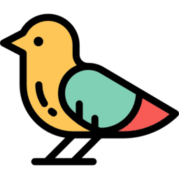
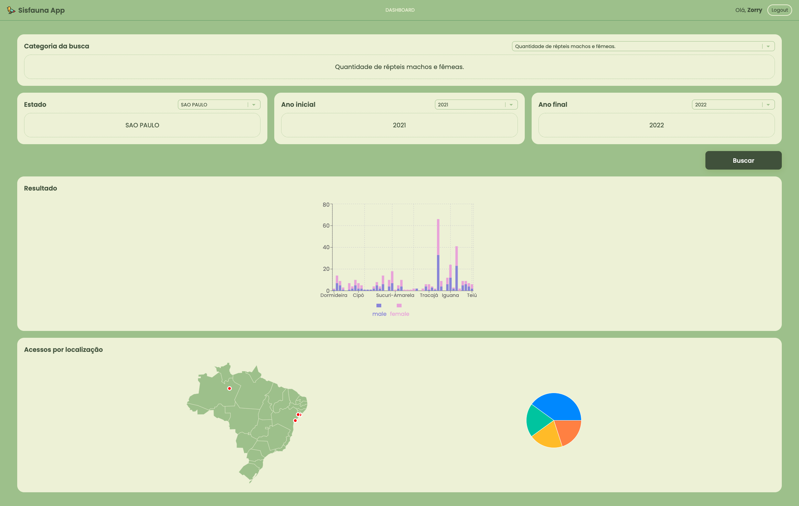

<div align="center" id="top"> 
  

  <a href="https://sisfauna-app.vercel.app/signin">Demo</a>
</div>

<h1 align="center">Sisfauna App</h1>

<p align="center">
  

  

  
</p>

<!-- Status 

<h4 align="center"> 
	🚧  University Sisfauna App 🚀 Under construction...  🚧
</h4> 
-->

<hr>

<p align="center">
  <a href="#dart-about">About</a> &#xa0; | &#xa0; 
  <a href="#sparkles-features">Features</a> &#xa0; | &#xa0;
  <a href="#rocket-technologies">Technologies</a> &#xa0; | &#xa0;
  <a href="#white_check_mark-requirements">Requirements</a> &#xa0; | &#xa0;
  <a href="#checkered_flag-starting">Starting</a> &#xa0; | &#xa0;
  <!-- <a href="#memo-license">License</a> &#xa0; | &#xa0; -->
  <a href="https://github.com/oliveiralecca" target="_blank">Author</a>
</p>

<br>



## :dart: About ##

This project was developed with the goal of practicing web development technologies and concepts. It was an evaluation of the Web Programming subject.   It is a web application about a Brazilian open source dataset that allows the user to choice some questions and filter them by state and years. 

## :sparkles: Features ##

:heavy_check_mark: User register on the open route;\
:heavy_check_mark: User sign-in;\
:heavy_check_mark: Some questions about the Sisfauna dataset;\
:heavy_check_mark: Some data filters by states and years;\
:heavy_check_mark: Data results with smart graphs;\
:heavy_check_mark: Tracking and counting of user location;\
:heavy_check_mark: Location results with map and graph

## :rocket: Technologies ##

The following tools were used in this project:

- [Vite](https://vitejs.dev/)
- [Node.js](https://nodejs.org/en/)
- [React](https://pt-br.reactjs.org/)
- [TypeScript](https://www.typescriptlang.org/)
- [Axios](https://axios-http.com/ptbr/docs/intro)
- [Prisma](https://www.prisma.io/)
- [JWT](https://jwt.io/introduction)
- [MongoDB Atlas](https://www.mongodb.com/atlas/database)

## :white_check_mark: Requirements ##

Before starting :checkered_flag:, you need to have [Git](https://git-scm.com) and [Node](https://nodejs.org/en/) installed.

## :checkered_flag: Starting ##

Server

```bash
# Clone this project
$ git clone https://github.com/oliveiralecca/university-sisfauna-app

# Access
$ cd university-sisfauna-app
$ cd backend

# Install dependencies
$ yarn or npm i

# Run the project
$ yarn dev:server or npm run dev:server

# The server will initialize in the <http://localhost:3333>
# You will need your own DATABASE_URL and SECRET_KEY env variables
```

Web

```bash
# Access
$ cd university-sisfauna-app
$ cd frontend

# Install dependencies
$ yarn or npm i

# Run the project
$ yarn dev or npm run dev

# The project will initialize in the <http://localhost:5173>
# You will need your own VITE_API_URL env variable with the backend URL 
```


&#xa0;

Made with 💕 by <a href="https://github.com/oliveiralecca" target="_blank">Letícia Oliveira</a>

&#xa0;

<a href="#top">Back to top 🔝</a>
